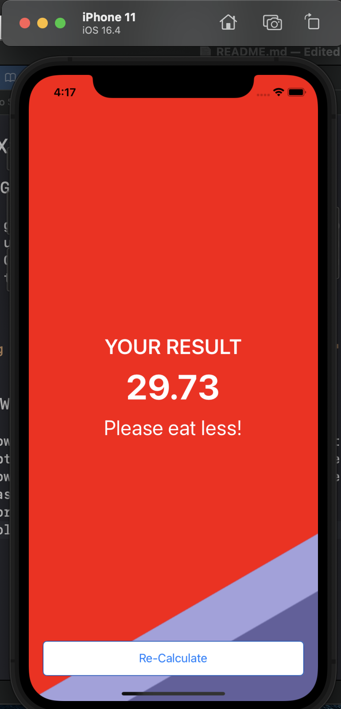
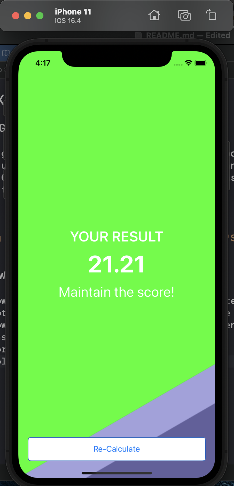
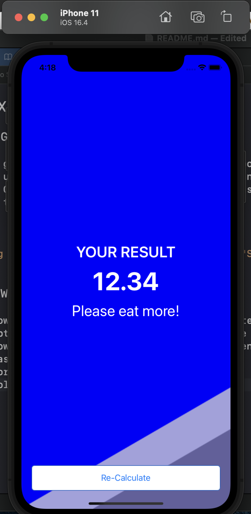

# BMI Calculator

## Goal

The goal of this tutorial is to learn more about Optionals, solidify the understanding of the MVC design pattern and to introduce the concept of Classes. compare objects created from classes with instances of Structs that I learnt about earlier.

## Home Screen

## Three different view of Bmi value

## What I learned

* How to create multi-screen apps with animated navigation.
* Optional binding, optional chaining and the nil coalescing operator.
* How to create classes and difference between classes and structs.
* Pass by value vs. pass by reference.
* Formatting Strings.
* Color literals.
