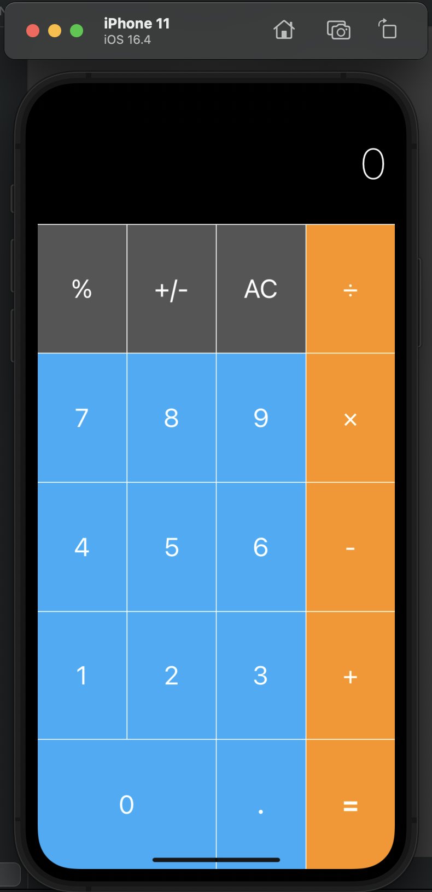
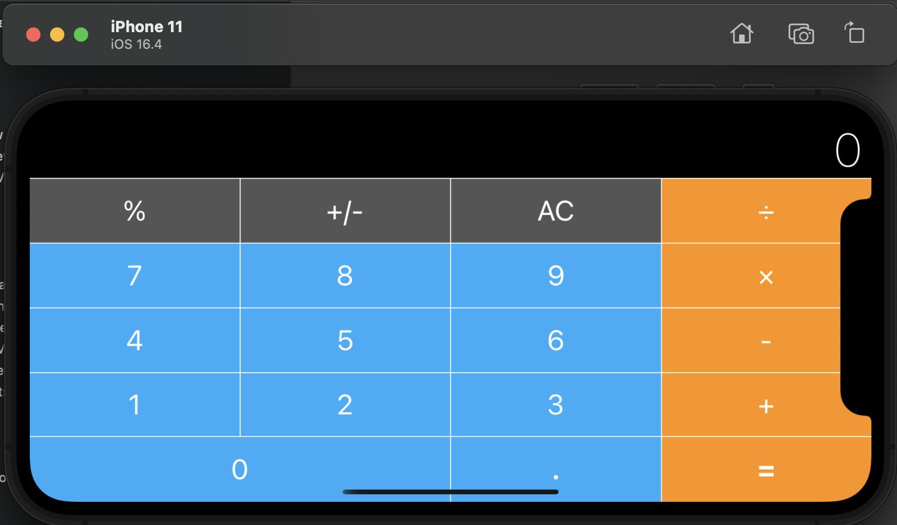

# Calculator Layout constraints

This calculator app was developed using Swift and relies on the power of constraint-based layout to provide a flexible and responsive user interface.

## Portrait

## Landscape

TThis repository contains a calculator app implemented in Swift that incorporates various constraints to enhance the user experience and ensure proper functionality. The calculator app is not allows users to perform basic mathematical operations such as addition, subtraction, multiplication, and division this is for only design perpose.
